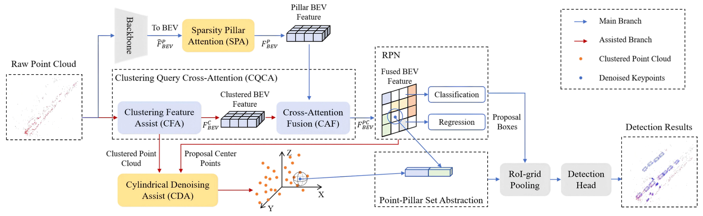

<div align="center">  

# MAFF-Net: Enhancing 3D Object Detection with 4D Radar via Multi-Assist Feature Fusion

</div>
<div align="center">   

[](https://ieeexplore.ieee.org/document/10923711/)

</div>

## 📰 News

- 📢 **2025.5.30** : The code is uploaded. Please stay tuned for updates. 

- 🔔 **2025.3.12**：[Early Access](https://ieeexplore.ieee.org/document/10923711/)

- ✨ **2025.2.27**: RA-L Accepted

## 📝 Abstract

Perception systems are crucial for the safe operation of autonomous vehicles, particularly for 3D object detection. While LiDAR-based methods are limited by adverse weather conditions, 4D radars offer promising all-weather capabilities. However, 4D radars introduce challenges such as extreme sparsity, noise, and limited geometric information in point clouds. To address these issues, we propose MAFF-Net, a novel multi-assist feature fusion network specifically designed for 3D object detection using a single 4D radar. We introduce a sparsity pillar attention (SPA) module to mitigate the effects of sparsity while ensuring a sufficient receptive field. Additionally, we design the cluster query cross-attention (CQCA) module, which uses velocity-based clustered features as queries in the cross-attention fusion process. This helps the network enrich feature representations of potential objects while reducing measurement errors caused by angular resolution and multipath effects. Furthermore, we develop a cylindrical denoising assist (CDA) module to reduce noise interference, improving the accuracy of 3D bounding box predictions. Experiments on the VoD and TJ4DRadSet datasets demonstrate that MAFF-Net achieves state-of-the-art performance, outperforming 16-layer LiDAR systems and operating at over 17.9 FPS, making it suitable for real-time detection in autonomous vehicles.

## ⚙️ Method



***Overview of the proposed MAFF-Net.*** *MAFF-Net consists of three components: the main branch, the assisted branch, and the detection head.
In the main branch, we apply sparse pillar attention (SPA) to the BEV features generated from the raw point cloud using a pillar-based method, ensuring global interaction and a sufficient receptive field.
The assisted branch introduces clustering query cross-attention (CQCA), using clustering feature assistance (CFA) to generate BEV queries for cross-attention fusion (CAF), which helps reduce noise and identify potential objects. We also design cylindrical denoising assistance (CDA), a sampling strategy inspired by cylindrical constraints, to filter noise and background points using the proposal's positional information.
Finally, fused BEV features are aggregated with clustered point cloud features at the keypoints' locations, and a multi-task detection head predicts the 3D bounding boxes.*

## 📜 Getting Started

step 1. Refer to [install.md](./docs/guidance/Install.md) to install the environment.

step 2. Refer to [dataset.md](./docs/guidance/dataset.md) to prepare View-of-delft (VoD) and TJ4DRadSet datasets.

step 3. Refer to [train_and_test.md](./docs/guidance/train_and_test.md) for training and testing.

## 📊 Model Zoo

We offer the model on VoD and TJ4DRadset.

|   Dataset    |                            Config                            |                                        Model Weights                                         | 
|:------------:|:------------------------------------------------------------:|:--------------------------------------------------------------------------------------------:|
|     VoD      |  [MAFF-Net_vod.yaml](tools/cfgs/MAFF-Net/MAFF-Net_vod.yaml)  | [Link](https://github.com/TRV-Lab/MAFF-Net/releases/download/checkpoints/vod2025010810360.pth) |
|  TJ4DRadSet  | [MAFF-Net_TJ4D.yaml](tools/cfgs/MAFF-Net/MAFF-Net_TJ4D.yaml) | [Link](https://github.com/TRV-Lab/MAFF-Net/releases/download/checkpoints/vod2025010810360.pth) |


## 🙏 Acknowledgment

Many thanks to the open-source repositories:
- [OpenPCDet](https://github.com/open-mmlab/OpenPCDet)

## 📚 Citation

If you find our work valuable for your research, please consider citing our paper:


```shell

@ARTICLE{Bi_MAFF,
  author={Bi, Xin and Weng, Caien and Tong, Panpan and Fan, Baojie and Eichberge, Arno},
  journal={IEEE Robotics and Automation Letters}, 
  title={MAFF-Net: Enhancing 3D Object Detection With 4D Radar Via Multi-Assist Feature Fusion}, 
  year={2025},
  doi={10.1109/LRA.2025.3550707}}

```

